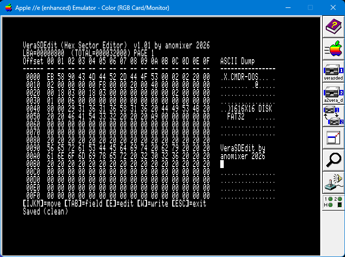

# verasdedit — VERA SD Card Hex Sector Editor



<!-- English first, 繁體中文 below -->

---

## Contents / 目錄

- 🇬🇧 **English**
  - [Directory contents](#directory-contents)
  - [Dependencies](#dependencies)
  - [Build](#build)
  - [Usage](#usage)
  - [Keys](#keys)
  - [verasdformat (FAT32 Formatter, W.I.P.)](#verasdformat)
  - [Technical background](#technical-background)
  - [Note on the vendored assembler](#vendored-assembler)
- 🇹🇼 **繁體中文**
  - [目錄內容](#cn-directory-contents)
  - [依賴](#cn-dependencies)
  - [建置](#cn-build)
  - [使用方式](#cn-usage)
  - [鍵盤操作](#cn-keys)
  - [verasdformat（FAT32 格式化工具，W.I.P.）](#cn-verasdformat)
  - [技術背景](#cn-technical-background)
  - [組譯器版本備註](#cn-vendored-assembler)

---

<a id="english"></a>
## 🇬🇧 English

**verasdedit** is a PC-Tools-style **6502 hex sector editor** that runs on the
Apple II (AppleWin emulator) with the **Commander X16 VERA** expansion card.
> （verasdedit 是一個 PC-Tools 風格的 6502 十六進位 sector editor，跑在
> Apple II（AppleWin 模擬器）的 Commander X16 VERA 擴充卡上。）

It reads any LBA sector of an SD card image directly over the VERA SD/MMC SPI.
The VERA base is **auto-detected (slot 2 `$C200`, else slot 4 `$C400`)**; SPI
data/status are `base+$1E`/`base+$1F` (`$C21E`/`$C21F` for slot 2). It displays
offset 0–511 as **hex + ASCII** in two pages (256 bytes / 16 rows each).
> （它透過 VERA 的 SD/MMC SPI 直接讀取 SD 卡影像的任一 LBA sector。VERA 基底
> 會**自動偵測（Slot 2 `$C200`，否則 Slot 4 `$C400`）**；SPI data/status 為
> `base+$1E`/`base+$1F`（Slot 2 是 `$C21E`/`$C21F`）。以 **hex + ASCII** 兩欄顯示
> offset 0–511 的內容——512 bytes 分兩頁，每頁 256 bytes / 16 rows。）

<a id="directory-contents"></a>
### Directory contents (git-tracked)

| File | Description |
|------|-------------|
| `verasdedit.asm` | 6502 assembly source: hex sector editor (loads at `$2000`, ~4.1 KB) |
| `verasdedit.mjs` | Build script (Node.js ESM): assembles `verasdedit.asm` → packs `verasdedit.po` |
| `startup.bas` | Applesoft BASIC boot program for VeraSDEdit |
| `verasdedit.po` | **Prebuilt ProDOS disk image** for VeraSDEdit (143360 bytes) |
| `build.bat` | One-click build script (Windows): `node verasdedit.mjs` |
| `verasdformat.asm` | 6502 assembly source: FAT32 SD formatter (loads at `$2000`, ~8.0 KB, W.I.P.) |
| `verasdformat.mjs` | Build script (Node.js ESM): assembles `verasdformat.asm` → packs `verasdformat.po` |
| `verasdformat_startup.bas` | Applesoft BASIC boot program for VeraSDFormat |
| `verasdformat.po` | **Prebuilt ProDOS disk image** for VeraSDFormat (143360 bytes) |
| `build_verasdformat.bat` | One-click build script (Windows): `node verasdformat.mjs` |
| `asm6502.mjs` | **Dependency**: 6502 assembler (`assemble6502`), vendored |
| `applebasic.mjs` | **Dependency**: Applesoft BASIC compiler (`compileApplesoftBasic`), vendored |
| `base/ProDOS_2_4_3.po` | **Dependency**: ProDOS 2.4.3 base disk image |

> `verasdedit/*.bin`, `*.bmp`, `*.png`, `test_asm*.mjs` are git-ignored.

<a id="dependencies"></a>
### Dependencies (self-contained — buildable after `git clone`)

All build dependencies live **inside the repo**. The only external requirement
is **Node.js**:

| Dependency | Purpose | Location |
|-----------|---------|----------|
| **Node.js** | Run `verasdedit.mjs` (ESM `import` syntax) | https://nodejs.org (Node 12+, `.mjs` support) |
| **`asm6502.mjs`** | 6502 assembler (exports `assemble6502`) | `verasdedit/asm6502.mjs` (vendored) |
| **`applebasic.mjs`** | Applesoft BASIC compiler (exports `compileApplesoftBasic`) | `verasdedit/applebasic.mjs` (vendored) |
| **`ProDOS_2_4_3.po`** | ProDOS 2.4.3 base disk image (build base; the script frees existing user files, keeping only PRODOS+SYSTEM) | repo root `bin/ProDOS_2_4_3.po` (already in repo) |

`verasdedit.mjs` uses **relative paths**, so it is cross-platform:

```js
import { assemble6502 } from "./asm6502.mjs"
import { compileApplesoftBasic } from "./applebasic.mjs"
const basePoPath = path.join(__dirname, "..", "bin", "ProDOS_2_4_3.po")
```

> To use your own toolchain / base disk, edit those lines.

<a id="build"></a>
### Build

```powershell
# Windows (one-click):
build.bat

# or manually (any platform):
node verasdedit.mjs
```

Successful output:

```
Created ...\verasdedit.po (143360 bytes)
  VERASDEDIT.BIN: 3848 bytes (load $2000)
  STARTUP: 783 bytes
```

Copy `verasdedit.po` to `Release\` and boot it in AppleWin.

<a id="usage"></a>
### Usage (AppleWin)

1. Start AppleWin, install the **VERA card in Slot 2 or Slot 4**, and mount an
   **SD card image** via the VERA card's "Configure..." dialog.
2. **If a hard disk is configured in Slot 7**, it boots first and the editor
   won't appear. Clear `Slot 7 → Last Harddisk Image 1` in the registry
   (`HKCU\...\Configuration\Slot 7`) before booting.
3. Boot `verasdedit.po` as the disk (`-d1` on the command line, or mount via
   GUI then reset).
4. `startup.bas` prints the banner, **detects the VERA card (slot 2 then slot
   4)** via PEEK/POKE, then `BRUN`s the editor (if neither slot has one it prints
   `No VERA Card Detected on Slot 2 or 4!` and ends). The editor re-detects the
   slot itself and reads LBA `800` (FAT32 boot sector):

```
VeraSDEdit (Hex Sector Editor)  v1.01 by anomixer 2026
LBA=00000800  (TOTAL=000nnnnnn) PAGE 1
Offset 00 01 02 03 04 05 06 07 08 09 0A 0B 0C 0D 0E 0F   ASCII Dump
------ -- -- -- -- -- -- -- -- -- -- -- -- -- -- -- --   ----------------
 0000  EB 58 90 43 4D 44 52 2D 44 4F 53 00 02 02 20 00   .X.CMDR-DOS... .
```

> `LBA=xxxxxxxx` is the current sector as 8 hex digits (32-bit — enough for the
> FAT32 2 TB ceiling). `(TOTAL=000nnnnnn)` is the SD image's **total sector count**
> (512-byte sectors), read from the card's CSD register via **CMD9 (SEND_CSD)** on
> startup — handy for knowing the FAT32 capacity boundary.

<a id="keys"></a>
### Keys

| Key | Action |
|-----|--------|
| `SPACE` | Toggle page (PAGE 1 ↔ PAGE 2) |
| `N` | Next LBA (LBA+1; from the last sector it wraps to 0) |
| `P` | Previous LBA (LBA−1; from 0 it wraps to the last sector, Total−1) |
| `R` | Reload current LBA |
| `L` | **Select LBA** — type 1–8 hex digits + `RETURN` to load, `DEL` backspace, `ESC` cancel back to the editor |
| `E` | Enter **editor** mode (see below) |
| `Q` | Return to ProDOS (BYE/RTS): restores ZP + IRQ vector, switches to 40-col, **HOME-clears the screen**, then returns |

> Command keys accept **both cases** (`N`/`n`, `P`/`p`, `R`/`r`, `L`/`l`,
> `E`/`e`, `Q`/`q`, and in the editor `I`/`i`, `J`/`j`, `K`/`k`, `M`/`m`).
> Only editor *data* input (hex nibbles / printable ASCII) stays case-sensitive,
> so lowercase ASCII can still be typed as data.
>
> The editor keys are `SPACE`/`N`/`P`/`R`/`L`/`E`/`Q`. Hex digits do *nothing*
> in the editor — LBA entry only happens inside the `[L]` select mode (where
> `0-F` is typed as an LBA digit, not a nibble edit). Nibble edits only happen
> in the editor.

#### Editor mode

Press `E` to edit the current page. The cursor moves over the hex and ASCII
columns; **changed bytes are shown inverse** (both nibbles) until written. The
**cursor cell always flashes** — in the hex field the nibble under the cursor
flashes, and in the ASCII field the cursor char flashes, even on a changed
(inverse) byte, so you can always see where the cursor is. After `W` the byte
renders normal.

The editor has two states:
- **Navigate** (default, on entry): `I`/`M`/`J`/`K` move the cursor, `TAB`
  switches the hex ↔ ASCII field, `E` enters the edit state.
- **Edit** (press `E`): keys now *modify* the byte under the cursor — `0-F`
  sets a hex nibble, a printable char sets the ASCII byte (including `IJKL`
  and `W`, which are typed as data here, not cursor movement / not a write;
  `E` is also typed as a nibble/char here). `W` writes **only** in navigate
  state. Press `CR` (Enter) to go back to navigate, or `ESC` to leave the
  editor.

| Key | Action |
|-----|--------|
| `I` / `M` | Move cursor up / down one row (byte ±16) — navigate state only |
| `J` / `K` | Move cursor left / right (hex column moves per nibble) — navigate state only |
| `TAB` | Toggle between the hex field and the ASCII field |
| `E` | Navigate state: enter edit state |
| `CR` | Edit state: stop editing, **accept** the edit, return to navigate |
| `ESC` | Edit state: **discard** the edit (re-read sector from SD), return to navigate; navigate state: leave editor to editor |
| `0–9 A–F` | Edit state, hex field: set the nibble under the cursor, advance (incl. `E`) |
| (printable) | Edit state, ASCII field: set the byte under the cursor, advance (incl. `IJKL`) |
| `W` | Write the whole sector back to the SD card (CMD24) — both `W`/`w`, shown in the navigate banner (`[E]=edit [W]=write`) |

> In the hex field the cursor flashes **only the nibble under it** (left/right),
> even on a changed byte — the flash marks the nibble being edited. A byte
> renders **inverse** only if its value actually differs from the original
> (the last-loaded sector); editing a byte back to its original value (e.g.
> `00` → `00`, or reverting `05` → `00`) clears the inverse again, so typing
> through untouched bytes never shows inverse. The cursor cell always flashes
> (hex nibble / ASCII char) even on a changed byte, so you can see where the
> cursor is; the other nibble of a changed cursor byte stays inverse, and changed
> non-cursor bytes render fully inverse.
> Typing a hex digit edits that nibble and advances high→low→next byte, so **both
> nibbles** of a byte are editable; the cursor starts at the high (left) nibble
> on entering edit mode.
>
> `Q` returns to ProDOS via the `BYE`/RTS convention (the BRUN return address),
> *not* the Applesoft warm-start `$3D2`. It restores the ZP/IRQ vector, switches
> to 40-col, and **HOME-clears the screen** so the `]` prompt is on a clean line.

* `W` writes **all 512 bytes** of the current sector (both pages) back via
  CMD24 (WRITE_SINGLE_BLOCK) — the guest sends the token `0xFE` + 512 data
  bytes + 2 CRC bytes.
* After `W` the dirty indicator clears; `ESC` without `W` discards changes.

<a id="verasdformat"></a>
### verasdformat — FAT32 Formatter for VERA SD/MMC (W.I.P.)

A companion utility in this repository that formats a VERA-attached SD/MMC card image to **FAT32** for use on the Apple II with CMDR-DOS and A2VERA.

- **MBR + Partition**: Writes an MBR partition table (partition type `$0C`, FAT32 LBA) starting at LBA 2048.
- **FAT32 Volume**: Formats VBR, FSInfo, backup VBR/FSInfo, FAT #1, FAT #2, and initializes root cluster 2.
- **Menu Options**:
  - `[1] Catalog SD`: Lists root directory 8.3 filenames and file sizes.
  - `[2] Format SD`: Quick format. Requires typing `FORMAT` + `RETURN` to confirm; `ESC` aborts.
  - `[3] Verify SD`: Reads back all metadata sectors via CMD17 and validates byte-for-byte against generated templates.
  - `[0] Exit`: Clean exit back to ProDOS.
- **Build**:
  ```powershell
  build_verasdformat.bat    # Windows one-click
  node verasdformat.mjs     # any platform
  ```
- **Running in AppleWin**:
  ```powershell
  AppleWin.exe -s2 vera -d1 verasdformat.po -power-on
  ```

<a id="technical-background"></a>
### Technical background

- **80-column display**: Apple IIe 80-column interleaves **AUX/MAIN** — each
  40-address text-page cell renders AUX(left)+MAIN(right)
  (`NTSC.cpp updateScreenText80`: `bits=(main<<7)|aux`). So even columns→AUX,
  odd columns→MAIN, cell offset = column/2.
- **Display setup**: after switching to 80-column text (`$C00D`), the guest must
  also set **80STORE OFF (`$C000`)** and **PAGE2 OFF (`$C054`)** so the display
  reads PAGE1 (`$0400`, where the guest writes). Forgetting these shows a
  garbled/inverse screen even though memory is correct.
- **RAM banking trap**: `$0200–$BFFF` is subject to RAMWRT(write)/RAMRD(read)
  soft-switches. `PUTCH` toggles the bank per char, which leaks into other
  memory ops (SCRATCH, sector buffer), so the guest must explicitly set
  `RAMWRTOFF`/`RAMRDOFF` before touching non-text-page memory.
- Display/keyboard and SD SPI timing details: see `AGENTS.md` in this repo.

<a id="vendored-assembler"></a>
### Note on the vendored assembler

The vendored `asm6502.mjs` includes three fixes you must keep if you ever replace it:
- **"preserve internal spaces in ASC strings"** (from the veratest toolchain
  repo). Without it, multiple spaces in `ASC` strings (e.g. the `0F   ASCII`
  header gap) are collapsed to one and the columns misalign.
- **`CPX`/`CPY` addressing-mode fix**. `CPX`/`CPY` now emit the correct opcode
  for the operand: immediate (`E0`/`C0`) for `#imm`, **zero-page (`E4`/`C4`)**
  for a ZP label (e.g. `CPX ZP_IBUFIDX`), and absolute (`EC`/`CC`) otherwise.
  The old version always emitted immediate, so `CPX ZP_IBUFIDX` compared X to
  the *address value* (114) instead of the memory contents — breaking the LBA
  input parse (typing `800` failed) and drawing garbage after `LBA>`.
- **`AND`/`ORA` must never take an indexed-`Y` operand.** 6502 `AND`/`ORA` only
  support indexed-`X`; the assembler's `AND`/`ORA` handlers silently emitted
  `AND $0000`/`ORA $0000` for `label,Y` (dropping both the label and `,Y`,
  resolving to address 0). Because `$0000` held `$FF`, this ORed `$FF` into the
  dirty-map byte — the "8-byte inverse" bug where editing one byte made the
  whole `00-07`/`08-0F` group render inverse. Compute bit masks by shifting
  (see `BITMASK` in the source) instead of `label,Y` table lookups.

---

<a id="chinese"></a>
## 🇹🇼 繁體中文

（開場中英對照已在上方串接，此處直接列出詳細內容。）

<a id="cn-directory-contents"></a>
### 目錄內容（git 追蹤）

| 檔案 | 說明 |
|------|------|
| `verasdedit.asm` | 6502 組合語言原始碼：十六進位磁區編輯器（載入 `$2000`，約 4.1 KB） |
| `verasdedit.mjs` | 建置腳本（Node.js ESM）：組譯 `verasdedit.asm` → 打包 `verasdedit.po` |
| `startup.bas` | Applesoft BASIC 啟動程式（VeraSDEdit） |
| `verasdedit.po` | **已建置好的 ProDOS 磁片影像**（VeraSDEdit，143360 bytes） |
| `build.bat` | 一鍵建置腳本（Windows）：`node verasdedit.mjs` |
| `verasdformat.asm` | 6502 組合語言原始碼：FAT32 SD 卡格式化工具（載入 `$2000`，約 8.0 KB，W.I.P.） |
| `verasdformat.mjs` | 建置腳本（Node.js ESM）：組譯 `verasdformat.asm` → 打包 `verasdformat.po` |
| `verasdformat_startup.bas` | Applesoft BASIC 啟動程式（VeraSDFormat） |
| `verasdformat.po` | **已建置好的 ProDOS 磁片影像**（VeraSDFormat，143360 bytes） |
| `build_verasdformat.bat` | 一鍵建置腳本（Windows）：`node verasdformat.mjs` |
| `asm6502.mjs` | **依賴**：6502 組譯器（`assemble6502`），已 vendored |
| `applebasic.mjs` | **依賴**：Applesoft BASIC 編譯器（`compileApplesoftBasic`），已 vendored |
| `base/ProDOS_2_4_3.po` | **依賴**：ProDOS 2.4.3 基底磁片影像 |

> `verasdedit/*.bin`、`*.bmp`、`*.png`、`test_asm*.mjs` 已被 `.gitignore` 排除。

<a id="cn-dependencies"></a>
### 依賴（已自包含，git clone 即可重建）

建置依賴**全部在 repo 內**，clone 後不需要另外準備（唯一外部需求是 Node.js）：

| 依賴 | 用途 | 位置 |
|------|------|------|
| **Node.js** | 執行 `verasdedit.mjs`（ESM `import` 語法） | https://nodejs.org （Node 12+，支援 `.mjs`） |
| **`asm6502.mjs`** | 6502 組譯器（匯出 `assemble6502`） | `verasdedit/asm6502.mjs`（已 vendored） |
| **`applebasic.mjs`** | Applesoft BASIC 編譯器（匯出 `compileApplesoftBasic`） | `verasdedit/applebasic.mjs`（已 vendored） |
| **`ProDOS_2_4_3.po`** | ProDOS 2.4.3 基底磁片影像（建置做底；腳本會清掉原有使用者檔，只留 PRODOS+SYSTEM） | repo 根 `bin/ProDOS_2_4_3.po`（已在 repo 內） |

`verasdedit.mjs` 全部用**相對路徑**，跨平台可用：

```js
import { assemble6502 } from "./asm6502.mjs"
import { compileApplesoftBasic } from "./applebasic.mjs"
const basePoPath = path.join(__dirname, "..", "bin", "ProDOS_2_4_3.po")
```

> 若想改用自己系統上的組譯工具/基底磁片，改這幾處即可。

<a id="cn-build"></a>
### 建置

```powershell
# Windows（一鍵）：
build.bat

# 或手動（任何平台）：
node verasdedit.mjs
```

成功輸出：

```
Created ...\verasdedit.po (143360 bytes)
  VERASDEDIT.BIN: 3848 bytes (load $2000)
  STARTUP: 783 bytes
```

把 `verasdedit.po` 複製到 `Release\` 並在 AppleWin 開機。

<a id="cn-usage"></a>
### 使用方式（AppleWin）

1. 啟動 AppleWin，安裝 **VERA 卡到 Slot 2 或 Slot 4**，並在 VERA 卡的「Configure...」裡選好 **SD 卡影像**。
2. **若 Slot 7 有設硬碟**，它會先開機，editor 不會出現——開機前先清掉
   `HKCU\...\Configuration\Slot 7` 的 `Last Harddisk Image 1`。
3. 把 `verasdedit.po` 當磁片開機（`-d1` 指定，或 GUI 掛載後 reset）。
4. `startup.bas` 印 banner、**用 PEEK/POKE 偵測 VERA 卡（先 Slot 2 再 Slot 4）**，
   偵測到才 `BRUN` editor（兩槽都沒有就印 `No VERA Card Detected on Slot 2 or 4!`
   並結束）。editor 再自己偵測一次 slot，讀取 LBA `800`（FAT32 boot sector）：

```
VeraSDEdit (Hex Sector Editor)  v1.01 by anomixer 2026
LBA=00000800  (TOTAL=000nnnnnn) PAGE 1
Offset 00 01 02 03 04 05 06 07 08 09 0A 0B 0C 0D 0E 0F   ASCII Dump
------ -- -- -- -- -- -- -- -- -- -- -- -- -- -- -- --   ----------------
 0000  EB 58 90 43 4D 44 52 2D 44 4F 53 00 02 02 20 00   .X.CMDR-DOS... .
```

> `LBA=xxxxxxxx` 是目前 sector，以 8 個 hex 位數顯示（32-bit——正好能涵蓋
> FAT32 的 2 TB 上限）。`(TOTAL=000nnnnnn)` 是 SD 影像的**總磁區數**
> （512-byte sector），開機時用 **CMD9（SEND_CSD）** 讀 CSD register 算出來，
> 方便知道 FAT32 容量邊界。

<a id="cn-keys"></a>
### 鍵盤操作

| 按鍵 | 功能 |
|------|------|
| `SPACE` | 換頁（PAGE 1 ↔ PAGE 2） |
| `N` | 下一個 LBA（LBA+1；在最後一顆磁區時繞回 0） |
| `P` | 上一個 LBA（LBA−1；在 0 時繞回最後一顆磁區 Total−1） |
| `R` | 重新載入目前 LBA |
| `L` | **選擇 LBA**——輸入 1–8 個 hex digit + `RETURN` 載入，`DEL` 退格，`ESC` 取消回 editor |
| `E` | 進入**編輯模式**（見下） |
| `Q` | 回 ProDOS（BYE/RTS：還原 ZP + IRQ vector、切回 40 欄、**先 HOME 清屏**再回） |

> 指令鍵**大小寫皆可用**（`N`/`n`、`P`/`p`、`R`/`r`、`L`/`l`、`E`/`e`、
> `Q`/`q`，編輯器內 `I`/`i`、`J`/`j`、`K`/`k`、`M`/`m`）。只有編輯器**資料輸入**
> （hex nibble / 可印 ASCII）維持大小寫敏感，所以小寫 ASCII 仍可當資料輸入。
>
> editor 的按鍵是 `SPACE`/`N`/`P`/`R`/`L`/`E`/`Q`。hex digit 在 editor **無作用**
> ——LBA 輸入只在 `[L]` 選擇模式內發生（此時 `0-F` 是 LBA digit，不是改 nibble）。
> nibble 編輯只在編輯模式內。

#### 編輯模式

按 `E` 編輯目前頁面。游標可在 hex 與 ASCII 欄移動；**改過的 byte 會反白**
（兩個 nibble 都反白），直到寫入。**游標格一律閃爍**——hex 欄游標所在的
nibble 閃爍、ASCII 欄游標字元閃爍，即使該 byte 已改過（反白）也照樣閃，
方便看出游標位置。按 `W` 寫入後該 byte 恢復正常顯示。

編輯器有兩個狀態：
- **瀏覽**（進入時的預設）：`I`/`M`/`J`/`K` 移動游標，`TAB` 切換 hex ↔ ASCII 欄，
  `E` 切進編輯狀態。
- **編輯**（按 `E`）：按鍵現在會**修改**游標下的 byte——`0-F` 設定 hex nibble、
  可印字元設定 ASCII byte（含 `IJKL` 與 `W`，在這裡是當資料輸入，不是移動游標、
  也不是寫入；`E` 在此也當 nibble/字元輸入）。`W` **只在瀏覽狀態**寫入。按 `CR`
  （Enter）回瀏覽，或按 `ESC` 離開編輯器。

| 按鍵 | 功能 |
|------|------|
| `I` / `M` | 游標上 / 下移一列（byte ±16）——僅瀏覽狀態 |
| `J` / `K` | 游標左 / 右移（hex 欄以 nibble 為單位）——僅瀏覽狀態 |
| `TAB` | 切換 hex 欄 ↔ ASCII 欄 |
| `E` | 瀏覽狀態：進入編輯狀態 |
| `CR` | 編輯狀態：停止編輯、**接受**編輯，回瀏覽 |
| `ESC` | 編輯狀態：**丟棄**編輯（重讀 SD sector）、回瀏覽；瀏覽狀態：離開編輯器回 editor |
| `0–9 A–F` | 編輯狀態，hex 欄：設定游標下的 nibble 並前進（含 `E`） |
| （可印字元） | 編輯狀態，ASCII 欄：設定游標下的 byte 並前進（含 `IJKL`） |
| `W` | 把整個 sector 寫回 SD 卡（CMD24）——`W`/`w` 皆可，navigate banner 顯示（`[E]=edit [W]=write`） |

> hex 欄的游標只閃爍**游標所在的 nibble**（左/右）。打一個 hex digit 會改該
> nibble 並前進 high→low→下一個 byte，所以**一個 byte 的兩個 nibble 都可編輯**；
> 進入編輯模式時游標從左邊（high）nibble 開始。
>
> `Q` 以 ProDOS `BYE`/RTS 慣例（BRUN 的回傳位址）回 ProDOS，**不是**
> Applesoft warm-start `$3D2`。會先還原 ZP/IRQ vector、切回 40 欄，並
> **HOME 清屏**，讓 `]` 提示符出現在乾淨畫面。

* `W` 透過 CMD24（WRITE_SINGLE_BLOCK）把目前 sector 的**全部 512 bytes**
  （兩頁）寫回——guest 送 token `0xFE` + 512 bytes data + 2 bytes CRC。
* `W` 後 dirty 指示清除；未 `W` 就 `ESC` 則捨棄修改。

<a id="cn-verasdformat"></a>
### verasdformat — VERA SD/MMC FAT32 格式化工具 (W.I.P.)

本儲存庫的第二個獨立工具，將 VERA 擴充卡上的 SD 卡影像格式化為相容 CMDR-DOS 與 A2VERA 的標準 **FAT32** 磁碟格式。

- **MBR 分割區**：建立 MBR 分割表，自 LBA 2048 起建立類型 `$0C`（FAT32 LBA）主要分割區。
- **FAT32 磁區結構**：依序寫入 VBR（開機磁區）、FSInfo、備份開機磁區、FAT #1、FAT #2，並初始化根目錄第 2 cluster。
- **功能選單**：
  - `[1] Catalog SD`：列出根目錄 8.3 格式檔名與檔案大小。
  - `[2] Format SD`：快速格式化。需手動鍵入 `FORMAT` 並按 `RETURN` 確認執行，按 `ESC` 隨時取消。
  - `[3] Verify SD`：透過 CMD17 逐一讀回所有中繼資料磁區，與樣板進行 512-byte 逐位元組比對驗證。
  - `[0] Exit`：還原零頁與中斷向量，乾淨返回 ProDOS。
- **建置方式**：
  ```powershell
  build_verasdformat.bat    # Windows 一鍵建置
  node verasdformat.mjs     # 跨平台建置
  ```
- **AppleWin 執行**：
  ```powershell
  AppleWin.exe -s2 vera -d1 verasdformat.po -power-on
  ```

<a id="cn-technical-background"></a>
### 技術背景

- **80-column 顯示**：Apple IIe 的 80 欄是**交錯 AUX/MAIN**——每個 40-address
  text-page cell 同時渲染 AUX(左)+MAIN(右)（`NTSC.cpp updateScreenText80`：
  `bits=(main<<7)|aux`）。所以偶數欄→AUX、奇數欄→MAIN，cell offset = 欄/2。
- **顯示初始化**：切到 80 欄文字（`$C00D`）後，guest 還要設
  **80STORE OFF（`$C000`）** 和 **PAGE2 OFF（`$C054`）**，讓顯示讀 PAGE1
  （`$0400`，也就是 guest 寫入的地方）。漏設會出現畫面反白/錯亂，即使記憶體
  內容是對的。
- **RAM banking 陷阱**：`$0200–$BFFF` 全受 RAMWRT（寫）/RAMRD（讀）soft-switch
  影響。PUTCH 每字元切 bank 會把 soft-switch 狀態帶到其他記憶體操作（SCRATCH、
  sector buffer），所以 guest 存取非 text-page 記憶體前都要顯式設
  `RAMWRTOFF`/`RAMRDOFF`。
- 顯示/鍵盤、SD SPI 時序等詳細說明見本 repo 的 `AGENTS.md`。

<a id="cn-vendored-assembler"></a>
### 組譯器版本備註

本目錄的 `asm6502.mjs` 已內含三個修正，日後更新組譯器務必保留：
- **「ASC 多空格保留」**（來源：veratest 工具 repo）。否則 header 多空格會被
  摺疊、顯示錯位。
- **`CPX`/`CPY` 定址模式修正**。`CPX`/`CPY` 現在依 operand 發正確 opcode：
  `#imm` → immediate（`E0`/`C0`）、**ZP label → zero-page（`E4`/`C4`）**（如
  `CPX ZP_IBUFIDX`）、否則 → absolute（`EC`/`CC`）。舊版一律發 immediate，所以
  `CPX ZP_IBUFIDX` 拿 X 去比**位址值 114** 而非記憶體內容，導致 LBA 輸入 parse
  失敗（打 `800` 讀取失敗）與 `LBA>` 後出現垃圾。
- **`AND`/`ORA` 不可用 indexed-`Y`**。6502 的 `AND`/`ORA` 只有 indexed-`X`；
  組譯器的 `AND`/`ORA` handler 對 `label,Y` 會靜默發出 `AND $0000`/`ORA $0000`
  （label 與 `,Y` 一起被丟掉、解析成位址 0）。因為 `$0000` 內容是 `$FF`，這會把
  dirty-map 那一格 OR 成 `$FF`——就是「改 1 個 byte → 00-07 整組反白」的 bug。
  請用位移算 bit mask（見原始碼 `BITMASK`），不要用 `label,Y` 查表。
